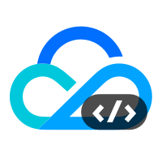
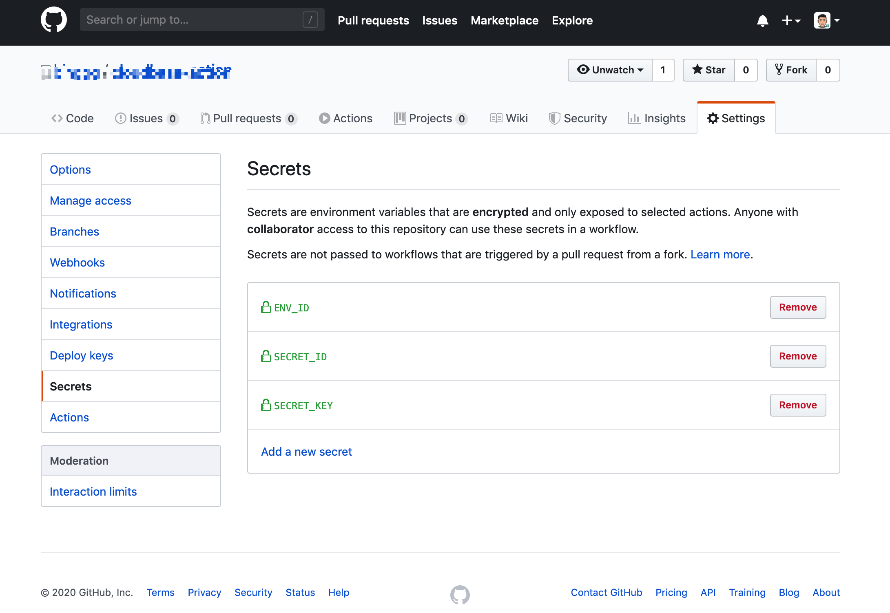

# Tencent CloudBase Github Action

[](https://github.com/TencentCloudBase/cloudbase-action/actions)

云开发 Tencent CloudBase  Github Action 可以将 Github 项目自动部署到云开发环境（目前支持静态托管功能，后续会支持其他资源）

- 云开发官网地址： [https://cloudbase.net/](https://cloudbase.net/)
- 云开发静态网站开通指南：[https://docs.cloudbase.net/hosting/](https://docs.cloudbase.net/hosting/)
- 云开发控制台地址： [https://console.cloud.tencent.com/tcb](https://console.cloud.tencent.com/tcb)
## 输入

>提示： 标注 🔐的参数属于敏感信息，需要放在项目的 `secret` 存储中，用法可以参考最后的实例 

### `secretId` 🔐

**Required** 云开发的访问密钥 secretId. 

在腾讯云[访问管理](https://console.cloud.tencent.com/cam/capi 
)页面获取 

### `secretKey`  🔐

**Required** 云开发的访问密钥 secretKey. 

在腾讯云[访问管理](https://console.cloud.tencent.com/cam/capi 
)页面获取 

### `envId` 🔐

**Required** 云开发的环境id envId. 

可以在云开发的控制台获取 [](https://console.cloud.tencent.com/tcb/env/index)

### `staticSrcPath`

Github 项目静态文件的路径。 默认值 `build`


### `staticDestPath`

静态资源部署到云开发静态托管的路径，默认为根目录。

## 输出

### `deployResult`

部署结果信息

## 参考示例

例如项目中的静态资源存放在 `build` 目录，希望部署到云开发静态网站托管的根目录下


可以编写如下的 Github Action 文件 `.github/workflows/main.yml`

```yaml
on: [push]

jobs:
  deploy:
    runs-on: ubuntu-latest
    name: Tencent Cloudbase Github Action Example
    steps:
      - name: Checkout
        uses: actions/checkout@v2
      - name: Deploy static to Tencent CloudBase
        id: deployStatic
        uses: TencentCloudBase/cloudbase-action@v1
        with:
          secretId: ${{ secrets.SECRET_ID }}
          secretKey: ${{ secrets.SECRET_KEY }}
          envId: ${{ secrets.ENV_ID }}
          staticSrcPath: build
      - name: Get the deploy result
        run: echo "Deploy to cloudbase result ${{ steps.deployStatic.outputs.deployResult }}"

```

在项目 Setting/ Secrets 里设置 `SECRET_ID`, `SECRET_KEY`, `ENV_ID` 信息



提交代码到 Github 时，就会自动部署到云开发到静态托管中
